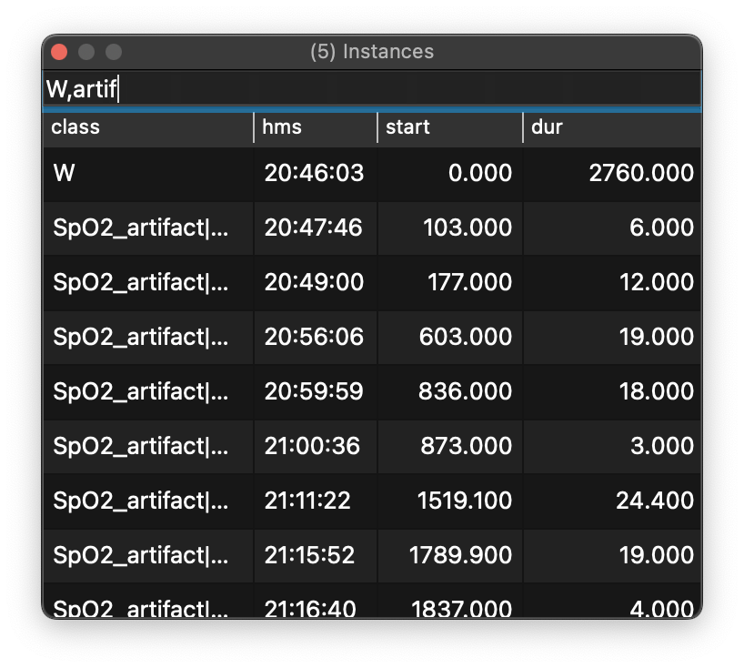

# Annotations

Here, annotations means any type of event-based data. Events can
represent stages (N1, N2, R, W), respiratory events, or user-defined
marks.

## Annotation classes

The Annotations dock lets you toggle event types and view time-stamped instances in the main viewing window.

{ width="60%" }

As for the Signals dock:

 - you can toggle between selecting _all_ or _none_ by clicking the top button (_Select all/none_)

 - you can filter rows by typing a comma-delimited list of annotations

When selecting an annotation class, all its instances are added to the _Instances_ dock table, described below.

## Instances

For selected annotation classes, this lists all instances, sorted by
clock-time. As well as clock-time, the table shows the event onset in
seconds past the EDF start time, and the duration of the event (also
in seconds).

{ width="60%" }

If you select an event by clicking on it, the main viewer will move to
that position in the recording: this provides an easy way to navigate
through the recording, e.g. to view detected spindles, if a spindle
annotation has been added.

You can also filter which instances are displayed in this table (based
on annotation class) by typing a comma-delimited list of terms, as in
the example above that retricts displayed rows to wake (W) and artifact events.

