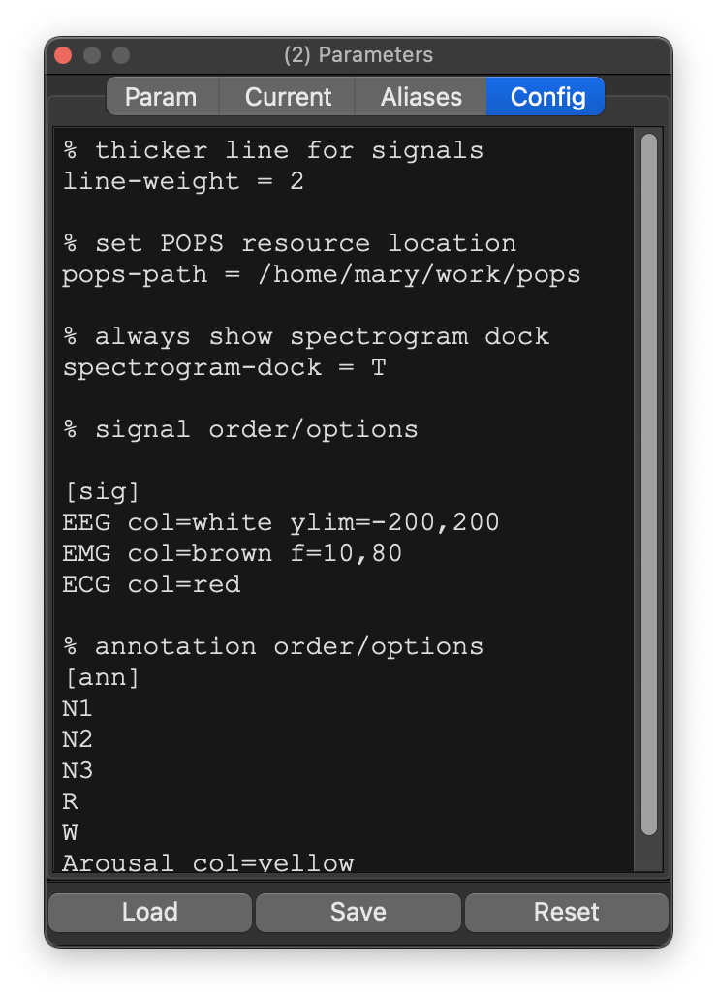
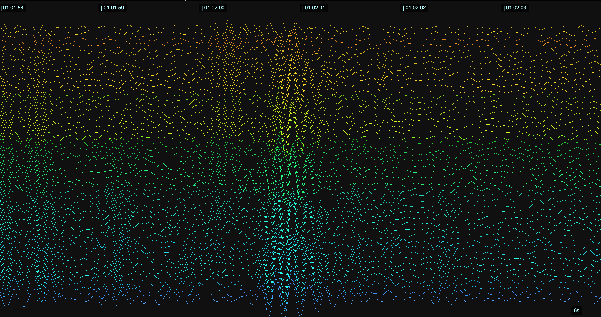

# Configuration files

Configuration files can be used to automatically control the behavior of Lunascope in a number of ways:

 - to determine the ordering of signals and annotations in the docks and main viewer

 - to specify bespoke colors for signals and annotations

 - to specify display y-axes ranges, as well as reference lines (e.g. at 0)

 - to specify filters (Butterworth IIR bandpass) with arbitrary transition frequencies

 - to set which docks are visible or hidden on start up

 - to specify the locations of resources for POPS

 - to control other options, e.g. behavior of copy/save outputs table with respect to missing values, etc

## Example config file

Here is a minimal example (e.g. a plaintext file called `basic.cfg`):

```
% thicker line for signals (slower to render, but better when screen sharing)
line-weight = 2 

% set POPS resource location
pops-path = /home/mary/work/pops

% always show spectrogram dock by default
spectrogram-dock = T

% signal order/options
[sig]
EEG col=white ylim=-200,200
EMG col=brown f=10,80 
ECG col=red

% annotation order/options
[ann]
N1
N2
N3
R
W
Arousal col=yellow
```

## Applying configurations

Configurations can be applied by adding the `-c` option on
first starting Lunascope:

```
lunascope s.lst -c basic.cfg
```

This populates the _Config_ tab of the _Settings_ dock:

{ width="50%" } 


Alternatively, you can add/edit the text in this _Config_ tab
directly, or use the _Load_/_Save_ options to load/save the
configuration as a plain text file.

Importantly, configurations are applied:

 - when first attaching a new record

 - when hitting _Refresh_ on an existing record


## Primary domains

A config file is a plaintext file that has a number of sections:

 - `[sig]` : per-signal config options

 - `[ann]` : per-annotation config options

 - `[par]` : general parameter settings as key-value pairs (e.g. controlling which docks are shown)

 - `%` : lines starting with `%` are treated as comments

Typically, the label must appear before the corresponding entries (one-per-line);
an exception is that the initial default section is `[par]`, i.e. so this:
```
line-weight = 2
```
is the same as this:
```
[par]
line-weight = 2
```

## `[sig]`: Signal options

After a `[sig]` flag, non-empty lines are assumed to start with the channel label, optionally followed by different arguments:

 - `col` : set the color of the signal, either as a hexcode (`#FFFFFF`) or name (`white`)
 - `ylim` : set the physical min/max, e.g. `ylim=-200,200`
 - `y` : draw reference lines at these _y_ values, e.g. `y=-80,0,80`
 - `f` : define a _User_ filter option, e.g. `f=10,30` for a bandpass 10 - 30 Hz filter
  
The order of the signals in this file determines the order in which
signals are shown in Lunascope.

### PSG example

Here we use a config file in a standard PSG setting, to group channels
by type (EEG, EMG, EOG, ECG, respiratory, etc):

```
[sig]
C3	col=#4DA6FF
C4	col=#4DA6FF
A1	col=#4DA6FF
A2	col=#4DA6FF
LOC	col=#66CCFF
ROC	col=#66CCFF
EMG1	col=#FF9933
EMG2	col=#FF9933
EMG3	col=#FF9933
LEFT_LEG1	col=#FF9933
LEFT_LEG2	col=#FF9933
RIGHT_LEG1	col=#FF9933
RIGHT_LEG2	col=#FF9933
ECG1	col=#FF3333
ECG2	col=#FF3333
AIRFLOW	col=#33CC33
NASAL_PRES	col=#33CC33
THOR_EFFORT	col=#33CC33
ABDO_EFFORT	col=#33CC33
SNORE	col=#33CC33
SUM	col=#33CC33
SpO2	col=#CC00CC
OX_STATUS	col=#CC00CC
PULSE	col=#CC00CC
PlethWV	col=#CC00CC
POSITION	col=#CCCC00
Light	col=#999999
HRate	col=#009999

[ann]
N1	col=#0066CC
N2	col=#0066CC
N3	col=#0066CC
R	col=#0066CC
W	col=#0066CC
Arousal_ASDA	col=#FF6600
ASDA_arousal	col=#FF6600
Hypopnea	col=#33CC33
SpO2_artifact	col=#CC00CC
SpO2_desaturation	col=#CC00CC
```

Here the colors are defined by hex codes, but you can use standard
color labels too.  Note that this example also orders the annotations
with the `[ann]` flag.

The above leads to this grouping/coloring of PSG channels (i.e. which
is different from the order in the original EDF)

{width="100%"}

### hd-EEG application

Lunascope supports visualization of high-density EEG recordings with
hundreds of channels.  Here, we used a color-map to order hd-EEG
channels along a anterior-posterior gradient, and color them
respectively.  (A single prompt to ChatGPT was used to generate this
file, in fact):

```
[sig]
Fp1	col=#d9bd20
Fpz	col=#f2d224
Fp2	col=#fedc25
AF7	col=#d98620
AF3	col=#d98620
AFz	col=#f29524
AF4	col=#fe9c25
...
```

Applying this, and using the Y-axis scaling/spacing options as
[described here](signal-viewer.md), we can see some nice renderings of
NREM transients, here in a small 6-second window.




## `[ann]` : annotations

Annotation order can be controlled the same way as for signals; in
terms of other options, only the `col` keyword is recognized however.

## `[par]` : general parameters

These options can be specified in a `[par]` block (or prior to any other block):

| Option | Values | Description |
|---|---|---|
|`show-lines`| `T`/`F` | Show _Y_=0 reference lines for _all_ channels | 
|`line-weight`| Numeric, `1+` | Set line weight (width) for main viewer (default 1 pixel) | 
| | | 
|`project-dock`| `T`/`F` | Show the project dock (default `T`) |
|`settings-dock`|`T`/`F` | Show the settings dock (default `T`) |
|`signal-dock`|`T`/`F` | Show the signal dock (default `T`) |
|`annot-dock`|`T`/`F` | Show the annotation dock (default `T`) |
|`instance-dock`|`T`/`F` | Show the annotation instances dock (default `T`) |
|`console-dock`|`T`/`F` | Show the console dock (default `F`) |
|`output-dock`|`T`/`F` | Show the output dock (default `F`) |
|`mask-dock`|`T`/`F` | Show the mask dock (default `F`) |
|`hypnogram-dock`|`T`/`F` | Show the hypnogram dock (default `F`) |
|`spectrogram-dock`|`T`/`F` | Show the spectrogram dock (default `F`) |
| | |
|`table-allow-empty`| `T`/`F` | Allow empty cells when exporting the _Outputs_ table (default `F`) |
|`na-token`| `.` | If marking empty cells, use this string (default `NA`) |
| | | 
|`pops-path`| Path, `C:\data\pops` | Point to current POPS resources | 
|`pops-model`| Model, `s2` | Specify the POPS model (default `s2`) |

## Rendered signals

Note that certain options (e.g. forcing y-axis ranges with `ylim`) will only take effect when looking at _rendered_ signal data.  