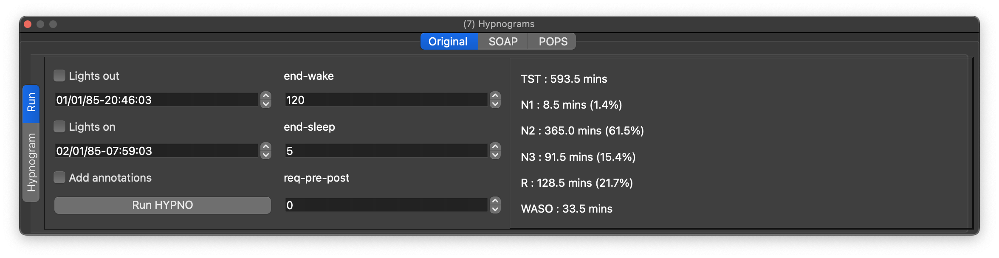
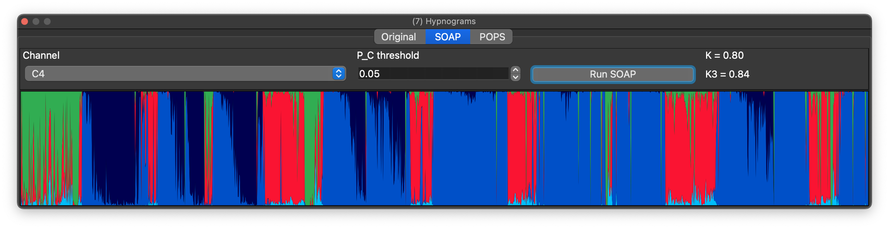
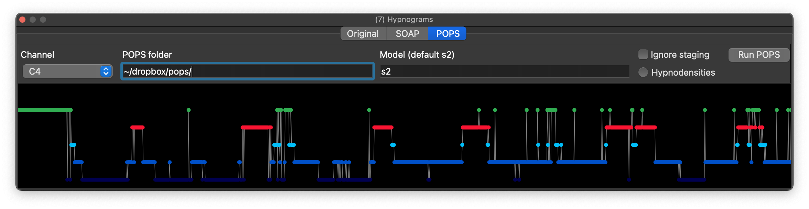
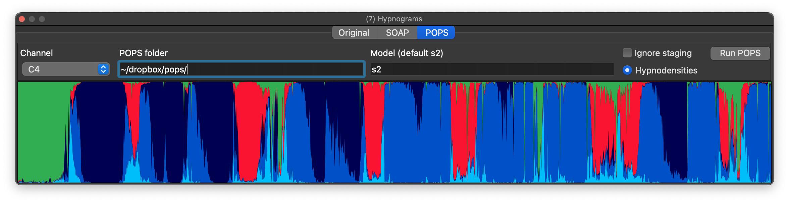
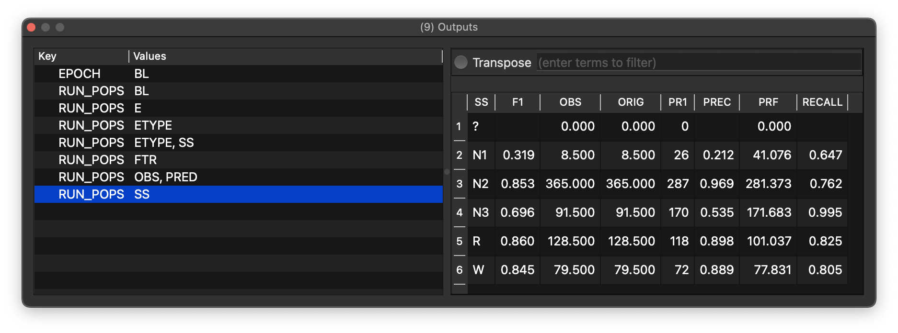

# Hypnograms

Hypnograms summarize sleep stages across time.

If valid staging data are present as annotations, a hypnogram will be generated, both in the
main signal view (navigation panel) but also in the hypnogram dock.

Note that stages must map to `N1`, `N2`, `N3`, `R`, `W` and `?`.  If other labels have been used, you can `remap` them via a [parameter file](parameters.md).

This tab also gives some simple summary statistics: e.g. stage
durations and WASO (minutes).  You can alter some of the options and
recreate these hypnogram statistics, e.g. by altering lights out/on
times and then pressing _Run HYPNO_.  See Luna documentation for more
details.

## Staging evalation (SOAP)

As [described here](https://zzz-luna.org/luna/ref/soap/), the SOAP command evaluates signal/staging consistency.  When staging are present, select a channel and
press _SOAP_ to generate the kappa coefficients and a SOAP-hypnodensity plot:

## Automated Staging (POPS)

To use POPS, first download and expand this [POPS resource .zip](http://zzz.bwh.harvard.edu/dist/luna/pops.zip). Then point the _POPS folder_ box to wherever you saved it, i.e. other than the default, which is set to `~/dropbox/pops/` (or use a [configuration file](config.md) to set the [`pops-path`](config.md#par-general-parameters) variable).

As [described here](https://zzz-luna.org/luna/ref/pops/), the POPS
system performs automatic sleep staging and hypnodensity
visualization.

Select a channel to use (currently, only the single-EEG `s2` model is supported), point Lunascope to where the POPS model files have been downloaded and click _Run POPS_.  This will produce a hypnogram output of predicted stages:

You can toggle between this view and the hypnodensities by clicking the _Hypnodensity_ radio button:

There is also an option to ignore any existing staging that might be
present.  (This means that the kappa statistics, etc, are not
computed; but also than all epochs will be included - otherwise,
epochs marked as unknown (`?`) are excluded from automated staging.)

You can see a fuller set of POPS metrics which are deposited in Luna's
primary _Output_ dock (Ctrl-9 and Cmd-9 keyboard shortcut).  For example, here
we see the stage specific metrics:

POPS will save new annotations (`N1`, `N2`, etc, or if staging already
exists, `pN1`, `pN2`, etc, meaning _predicted_ stage).  These
annotations can be selected from the [Annotations
table](annotations.md), used in [masks](masks.md), or other [Luna
commands](scripts.md).

If you want to set different options (e.g. multiple channels) then use
the `RUN-POPS` or `POPS` commands in the [_Console_](scripts.md) to
run _POPS_ generically rather than using this convenience interface (it calls the same underlying code).