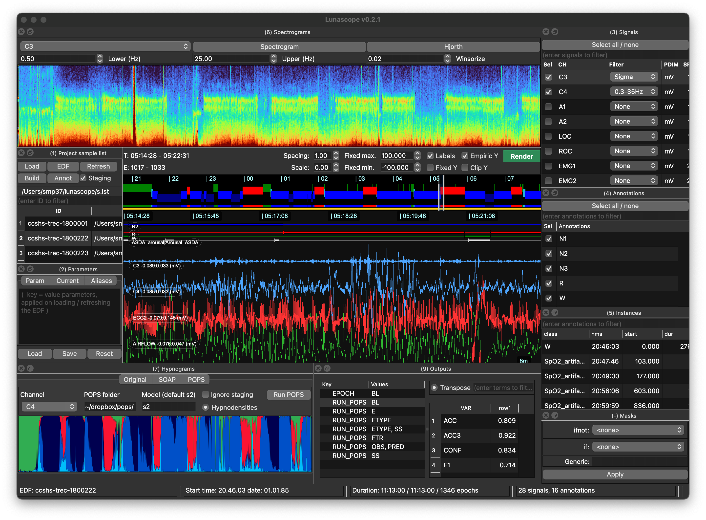
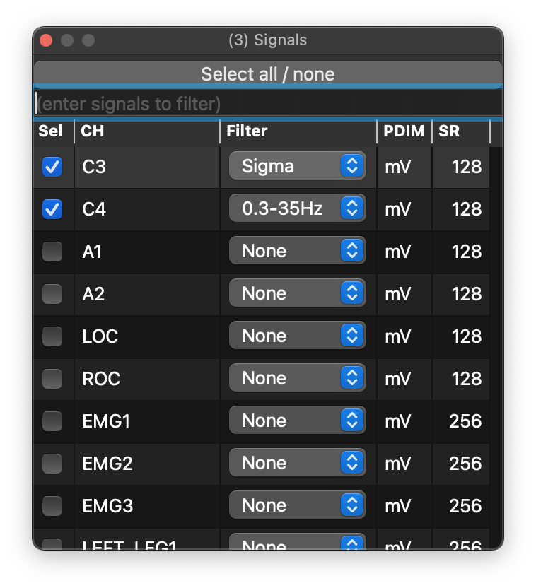
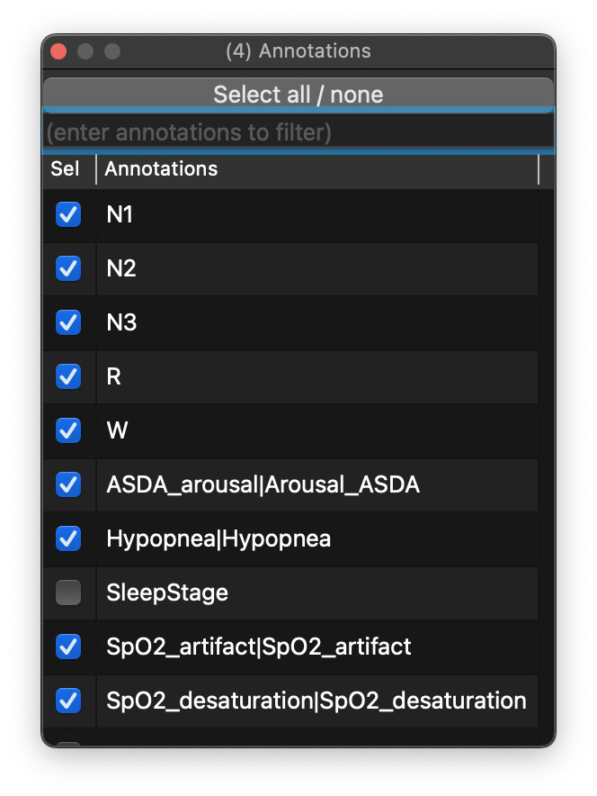
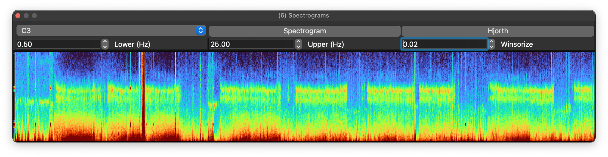
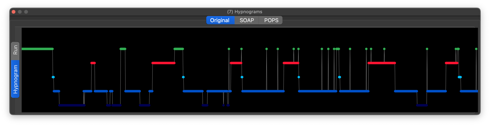
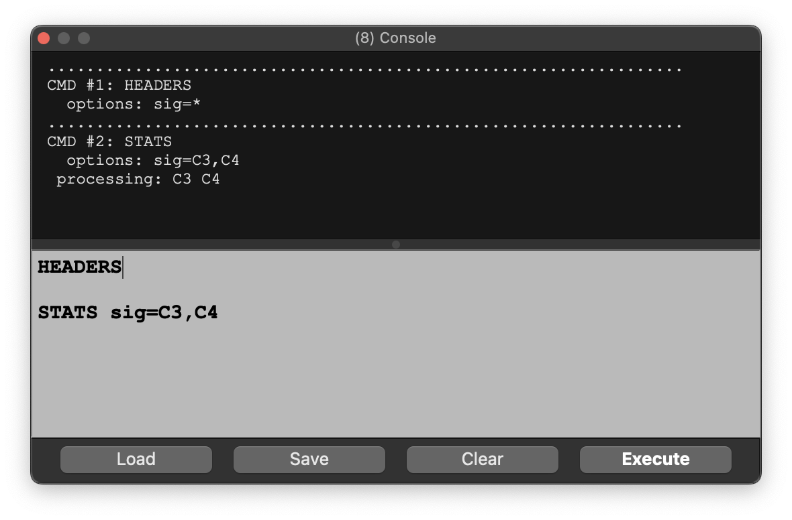
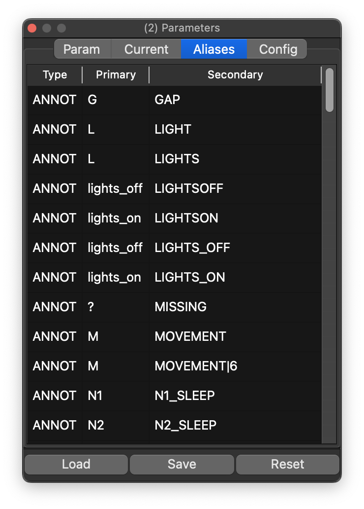
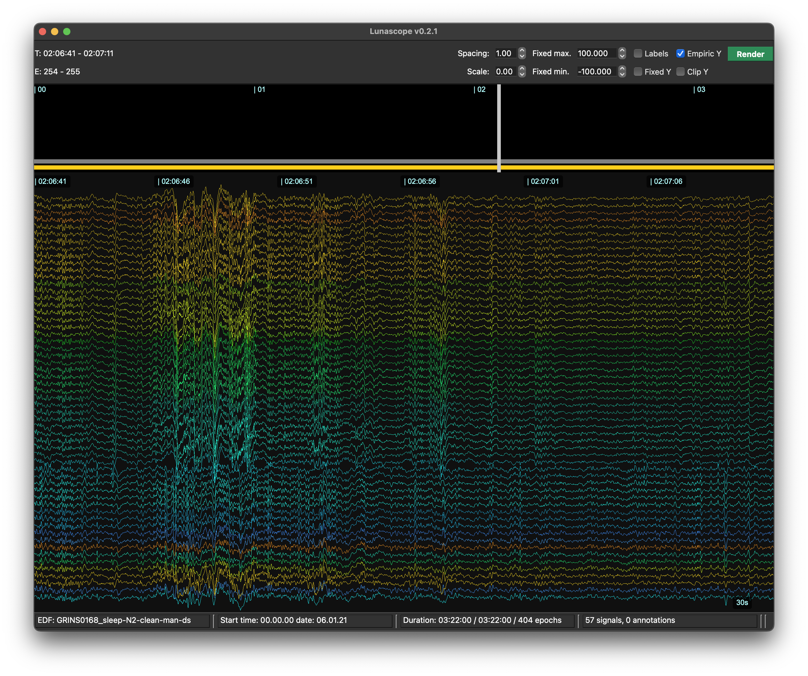

# Lunascope v0.2.3

Lunascope is an interactive EEG and sleep signal viewer built on top
of the [Luna suite](https:/zzz-luna.org/luna).  It provides
synchronized visualization of signals, annotations, and sleep staging.

{ width="100%" }

## Documentation sections

| Sections | | | 
|---|---|---|
| [Installation](install.md) | Installing and running Lunascope | `pip install lunascope` |
| [Overview](overview.md) | Instructions for loading EDF files, annotation sets, and defining sample lists. | {width="80%"} |
| [Loading Data](loading.md) | Instructions for loading EDF files, annotation sets, and defining sample lists. | {width="85%"} |
| [Signal Viewer](signal-viewer.md) | Main viewer for synchronized time navigation across channels. | {width="85%"} |
| [Signals](signals.md) | Signal selection and viewing options |  {width="50%"} | 
| [Annotations](annotations.md) | Toggle annotation types, view event instances |  {width="45%"} |
| [Spectrograms](spectrograms.md)  | Time–frequency views and spectral summaries | {width="90%"} |
| [Hypnograms](hypnograms.md) | Automatic and manual staging, including SOAP and POPS   | {width="90%"} |
| [Luna Scripts](scripts.md) | Examples of scripting workflows in Lunascope | {width="85%"} | 
| [Parameters](parameters.md) | Details of parameter configuration and editing through the parameter dock | {width="40%"} |
| [Configuration](config.md) | Specifying channel ordering, coloring and other properties | {width="80%"} |

## Development status

Lunascope is a new software package and v0.2.3 is an _alpha_ release.
As such, there are likely to be some [rough
edges](updates.md#known-issues) not yet smoothed. Feedback on bugs or
other issues is appreciated.

## Contact

Lunascope was created by Shaun Purcell and is developed and
maintained by Lorcan Purcell.

Questions: [luna.remnrem@gmail.com](mailto:luna.remnrem@gmail.com)

