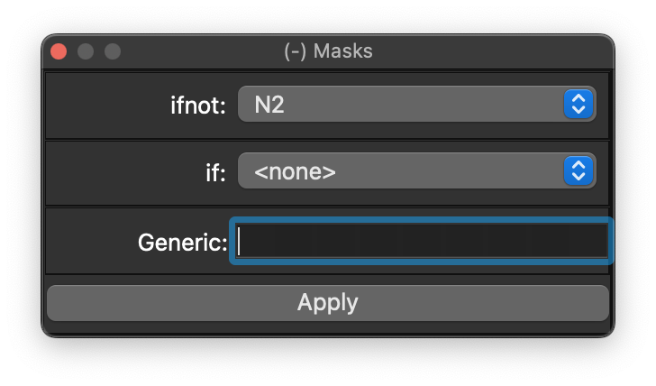

# Masks

This dock can be used to perform simple epoch-level masks of the currently attached recording.

{ width="60%" }

This exposes two common masks: to exclude epochs that don't match, in
terms of having that annotation overlapping the epoch (`ifnot`), or to
exclude epochs that do match (`if`).  One can also enter generic
masks, using the same syntax as Luna uses for all
[`MASK`](https://zzz.bwh.harvard.edu/luna/ref/masks.md) commands.

Note that one can use the [console](scripts.md) to run `MASK` commands also - the behavior
is indentical to using this convenience widget.
