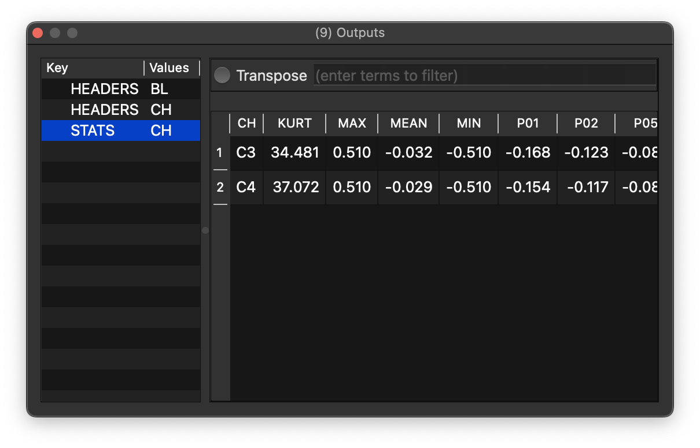
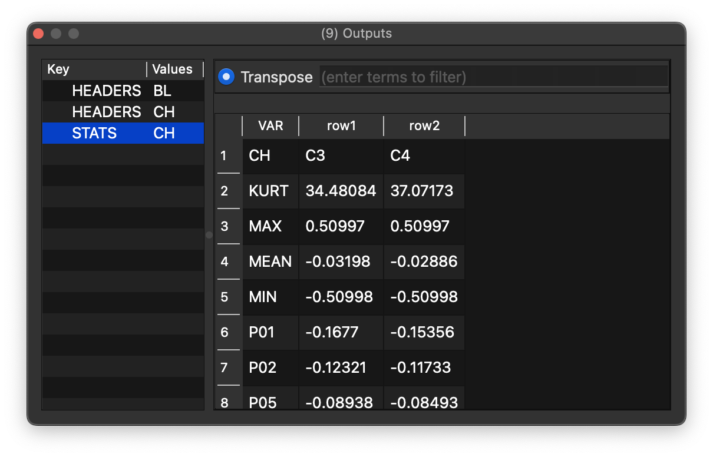
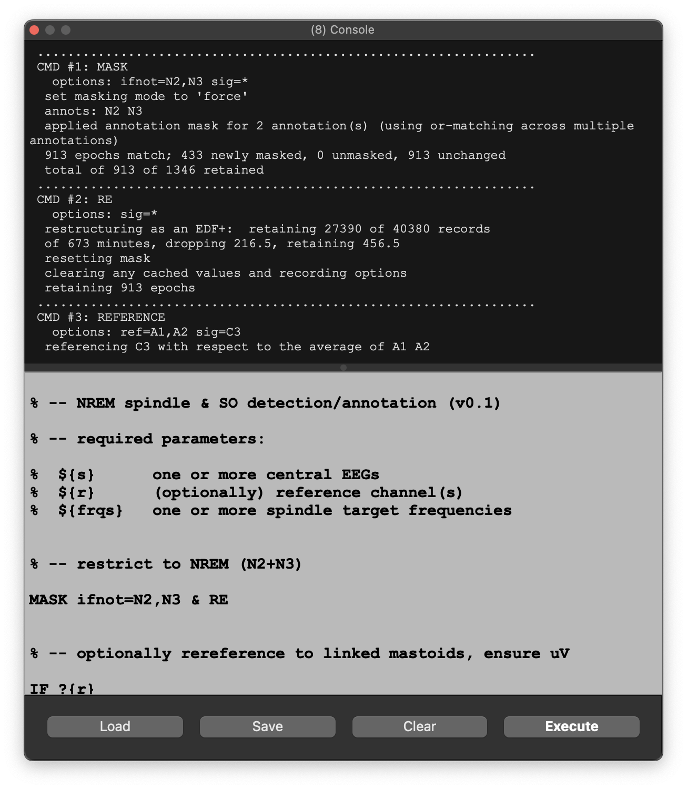
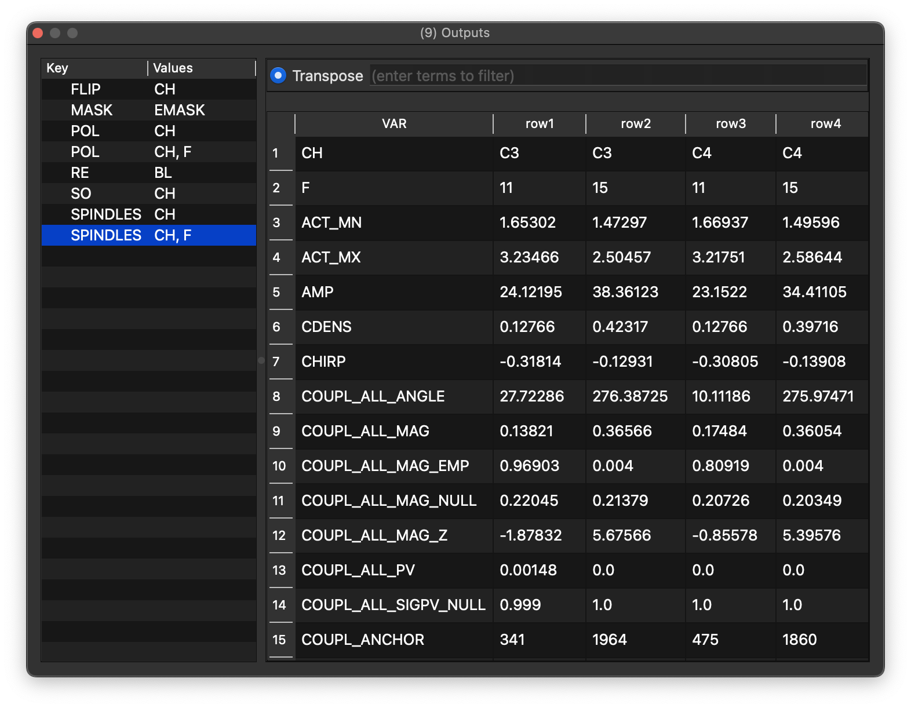
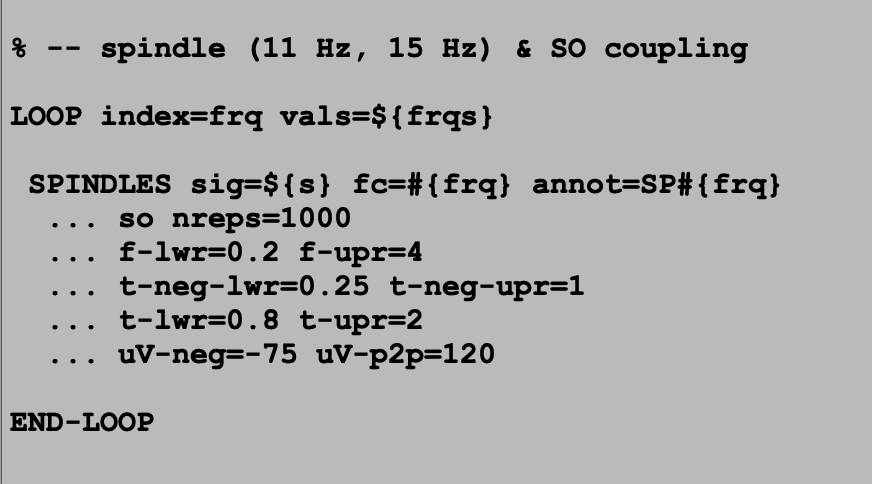
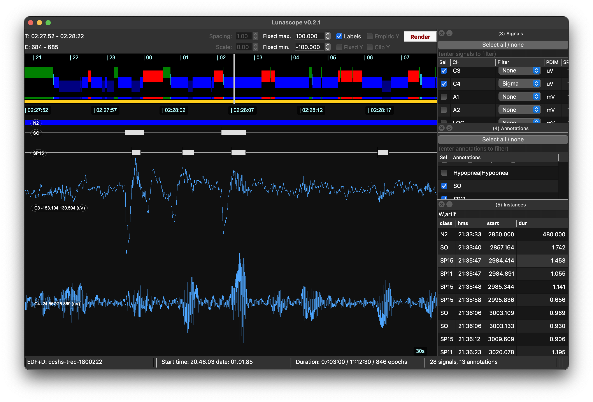
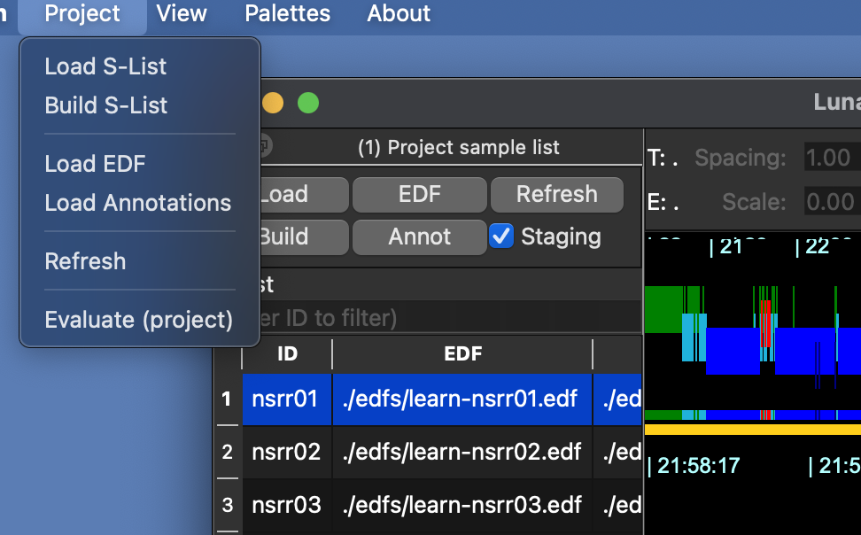
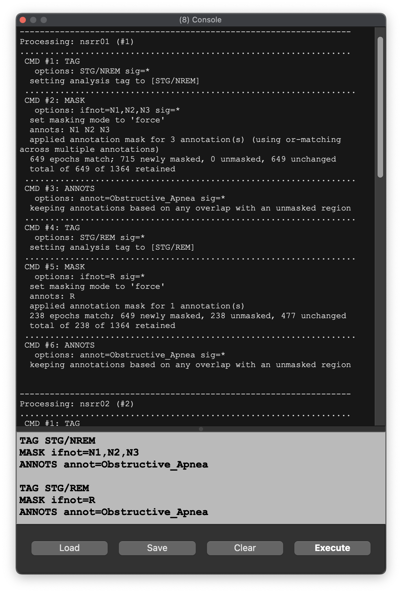
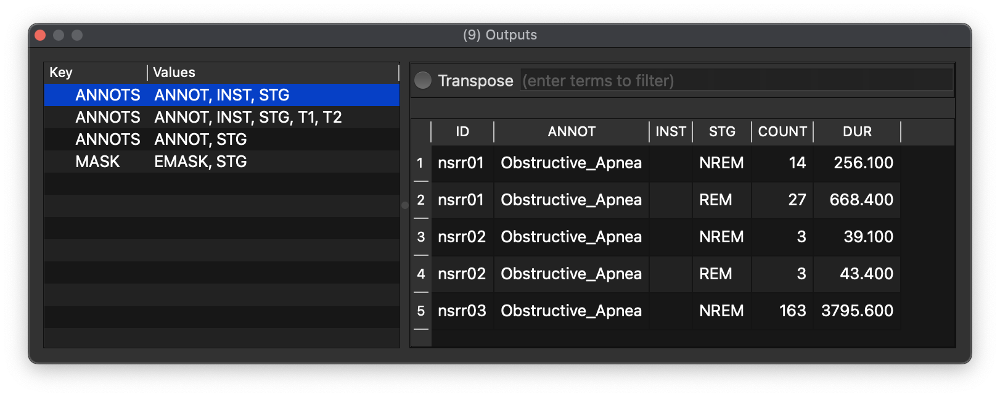

# Luna Scripts

Lunascope can execute **Luna scripts** to automate processing.  These docks are hidden by default, but can be
raised by either the View menu, or Ctrl/Cmd-8 (console dock) and Ctrl/Cmd-9 (output dock).

## A simple script

To apply the `HEADERS` and `STATS` command, i.e. similar to running

```
luna s.lst 1 -o out.db -s ' HEADERS & STATS sig=C3,C4 '
```
enter the script in the console (which can also save/load scripts):


and then press _Execute_.  This will send any output to the output dock.  For example, this table is
the same as the command line

```
destrat out.db +STATS -r CH
```



You can transpose the table for easier viewing, as needed.



### Exporting tables

You can select the whole table (click top left), or individual rows, columns or cells and either _Copy_ those
data to the clipboard or save them as a TSV file, by right-clicking in the table.  The exported data will always
contain column headers.  If a filter is currently applied, only filtered rows will be exported.


---

## A more involved case

Here we have an example script to detect NREM spindles and slow oscillations, which takes optional arguments, and adds annotations (reflecting spindle/SO events):



If we load this script and just press _Execute_ we'll get an error message:

{ width="50%" } 

This correctly notes that `${s}` (the signals to use) is required but has not been specified.  These need to be specified in the [parameter](parameters.md) dock (ignore the top examples in this case, but not how variables `${s}`, `${r}` (the reference channels) and `${frqs}` (the spindle frequencies) have been specified: 

{ width="50%" } 

This is now the equivalent to writing
```
luna s.lst 1 -o out.db s=C3 r=A1,A2 frqs=11,15 < spindle.txt
```
(assuming the Luna script is called `spindle.txt`).

Now it should run properly (i.e. assuming channels `C3`, `A1` and `A2` exist, and there are NREM annotations) and give output as follows: here it shows spindle metrics for fast and slow (`F` = 15 and 11 Hz) for two channels (here, `s=C3,C4` obviously, rather than a single channel):



Inspecting the script, we see it will generate annotations (`SP11` and `SP15` as well as `SO`) marking where detected spindles occur.   After running the script, these will be attached to the in-memory instance, and can be viewed (or used in any subsequent Luna command, until _Refresh_ is hit or a new EDF loaded):

{ width="60%"}

Selecting the two EEG channels -- and applying sigma-filtering on one of them -- as well as the relevant annotations, you can explore the detected NREM transient events in this dataset:




## Batch processing

Although Lunascope is centrally designed around viewing a single
recording, it can sometimes be convenient to apply a script to
multiple recordings grouped as a sample-list.

___Importantly, note that for non-trivial batch processing
applications it is strongly suggested that you use command-line Luna,
specifically designed for batch processing, not the Lunascope
interactive viewer, for a more flexible, powerful, reproducible and
robust pipeline.___


A batch job in Lunascope applies the current Luna script to all
samples in the current sample list, iteratively.  For example, consider
we have this script, to enumate the number of NREM and REM obstructive
apnea events, respectively:

```
TAG STG/NREM
MASK ifnot=N1,N2,N3 
ANNOTS annot=Obstructive_Apnea

TAG STG/REM
MASK ifnot=R 
ANNOTS annot=Obstructive_Apnea
```

Instead of clicking the _Execute_ button (that applies the script to the current state
of the attached EDF), use the top menu _Project / Evaluate (project)_:

{ width="50%" }

This loads each EDF sequentially, runs the job, and saves any
output. Only after all jobs are finished, the console will update with
the output:

{ width="70%" }

When finished, the viewer will have the final record in the sample
list loaded.

The outputs are collated and then displayed in a single, collated
form. An `ID` column (based on the sample list ID) is added to each
table to indicate to which individual those data belong:

{ width="100%" }

Note that Lunascope does not parallelize jobs and will freeze the GUI
while jobs run.  As such, it can be difficult to see the progress of
long-running jobs.  Also, it will not automatically save all
outputs. As noted, for these and other reasons, Lunascope is not the
right tool for non-trivial batch jobs.