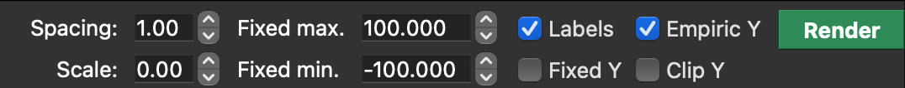
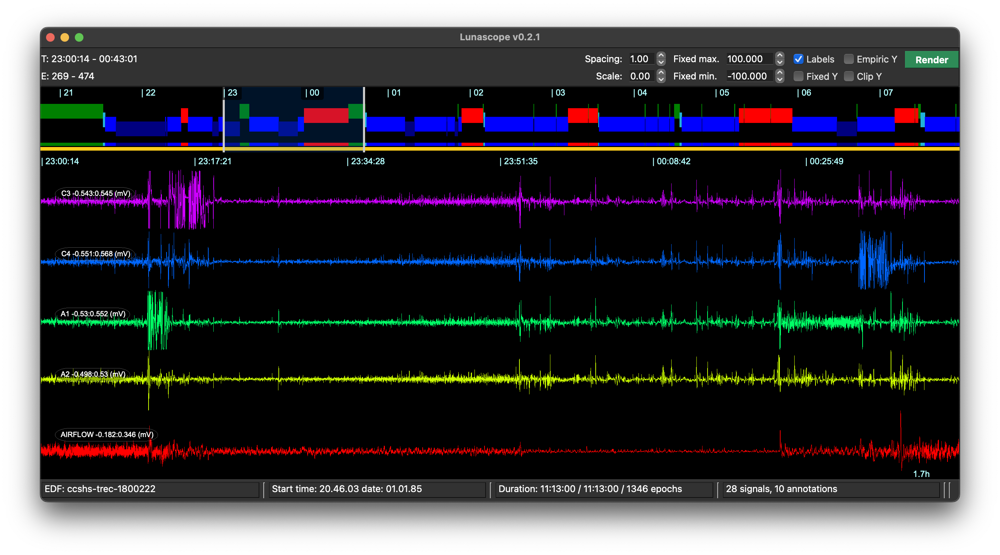
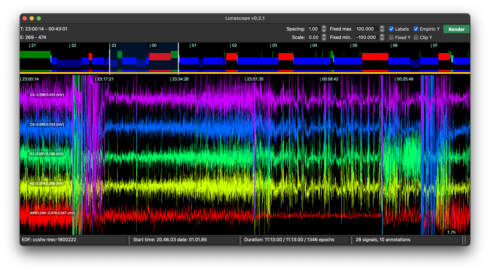
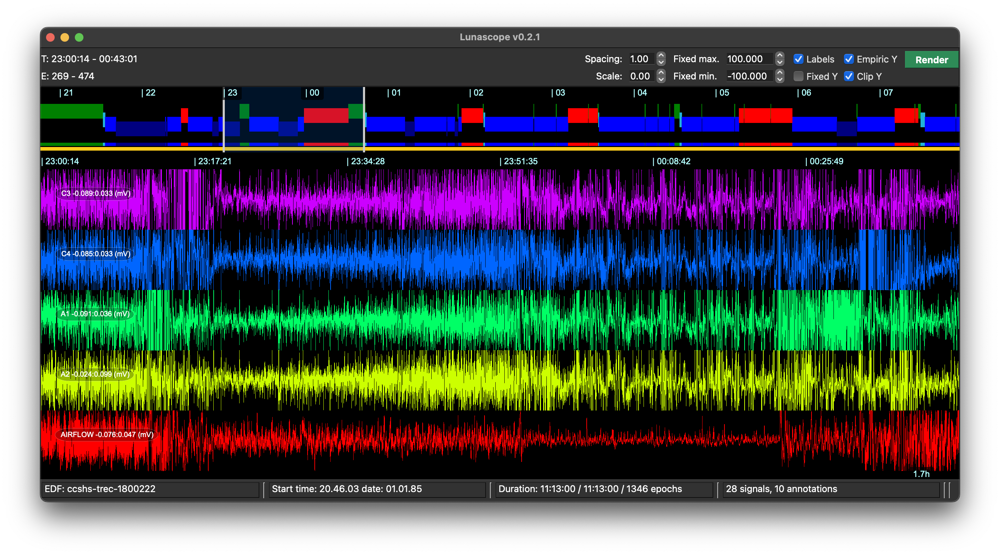

# Signal Viewer

The central viewer displays synchronized multi-channel PSG signal and annotation data.

## Top panel

{width="100%"}

The top panel displays:

 - clock-times in hour intervals (24-hour format) across the top

 - a representation of the hypnogram, when staging data are present: NREM, REM and wake are blues, red and green respectively

 - a lower, smaller representation of the currently included (i.e. _unmasked_ epochs) at the bottom

## Pan/zoom navigation

You navigate across signals by clicking on this top panel.  The white bar (here around 10pm or 22:00) dictates the interval shown in the lower panel.

As well as using the mouse, you can use the cursor keys:

 - left/right : move one epoch (30-seconds) backwards or forwards in time

 - shift + left/right : move multiple epochs backwards or forwards

 - up/down : zoom in/out, to change the span of the lower panel; unless you've _Rendered_ the data (see below), the maximum span is 30 seconds

 - click-and-drag: if you've _rendered_ the data, you can click-hold-drag to select larger windows of time to be shown;  if you double-click within the selected region, it will return to a single epoch view;  you can resize or drag the larger interview by selecting it

Zoom and pan controls enable precise inspection of signal segments.

For continuous signals (those will more than 20 discrete values), when
zooming out, at a certain point Lunascope will show the min/max per
"pixel-timepoint" (i.e. the interval of time that corresponds to a
single pixel on the screen); when zooming out even further, to prevent
saturation, Luna will show the interquartile range (25th/75th) as
approximated by a robust estimate of the standard deviation.

## Rendering data

A main panel also contains some widgets for altering the view, including a _Render_ button.

{ width="80%" } 

Internally, the view operates in two modes:

 - on first attaching an EDF, Lunascope loads signals directly from
   the in-memory EDF on an _as needed_ basis to plot them; signals and
   annotations can be included or excluded from the view by clicking
   on the respective [signal](signals.md) or
   [annotation](annotations.md) dock. In this mode, however, there is a restriction that no
   more than 30 seconds of signal data can be viewed at a time (there
   is no restriction for annotation-only views).

 - on pressing _Render_, Lunascope effectively takes __a snapshot of
   the currently selected signals and annotations__, then processes
   those data for more efficient viewing; subsequently, all items
   displayed are from the _cached_ or _rendered_ data store.

Rendering involves generating decimated (downsampled) versions of the data, with
anti-alias filtering, and allows for subsequent further downsampling
to enable large intervals of time to be displayed (i.e. hours) without
Lunascope trying to plot millions of sample points directly (which
would slow plotting).

There are three main advantages to rendering signals:

 - it allows for larger windows to be viewed efficiently

 - it allows for better Y-axis scaling of signals (see below)

 - it precomputes various summary statistics and other things that can
   enhance visualization (although these are not yet included in the
   alpha release of Lunascope)
 

Three things to be mindful of when using the rendering option:

 - Although rendering speeds up subsequent viewing, the process itself can
 take a few moments as it has to pre-process the entire dataset.
 Especially for large studies with many signals and high sampling
 rates, only use this function if you need it.

 - Rendering takes a snapshot of _the currently selected signals and
 annotations_.  If you want to add a new signal to the view, you need
 to press _Render_ to re-render after selecting that signal or
 annotation. (You can drop remove/add back in rendered
 signals/annotations without re-rendering however.)
 
 - If you change the underlying signal data -- e.g. filtering,
 referencing or rescaling, etc via the [console](scripts.md) -- these
 changes will not be directly shown (unlike the initial, unrendered
 view, which directly pulls data from the in-memory EDF
 representation).  Rather, one needs to press _Render_ again to update
 the rendered view.  To indicate this, Lunascope always sets the
 Render button to __orange__ after running _any_ Luna script, as a
 reminder that the underlying data may have changed.  If in doubt,
 just press _Render_ once more to update the view.

## Y-scaling

After rendering, the button turns from __white__ to __green__ to indicate that
display items will now be drawn from the current snapshot. As noted, rendering
also allows for different y-axis scaling:

{ width="80%" }

 - by default, unrendered signals are plotted to autoscale within the
   view window - i.e. each track will be scaled such that the minimum
   and maximum signal values are at the bottom/top of each track; as
   one scrolls left or right, the scale can change; extreme values will implicitly squash the rest of the signal to a near flat line

 - _Empiric Y_ : after rendering, the bottom/top of each track is set to the 10th
   and 90th percentile of the signal value; this fixes the scale and gives a generally
   sensible view of most signals, which can make it more intuitive to see changes in signal amplitude scrolling left/right; extreme values
   will now be drawn below or above the actual track, i.e. meaning tracks can overlap

 - _Clip Y_ : this stops overlap across channels with empiric scaling,
   by clipping the signal to the top/bottom of each track

Examples are these three viewes for the same interval and set of signals:

Default (autoscaling):

Empiric scaling:

Empiric scaling with clipping:

## Other viewing options

You can also:

 - hide/show the labels for signals and annotations, through the _Labels_ checkbox

 - set fixed Y-axis minimum and maximum values, by selecting _Fixed Y_ and adjusting the min./max. values; note this currently applies to _all_ signals

 - alter the scaling and spacing of each signal track;

 - _spacing_ controls whether tracks are typically spaced (value of 1.0) versus, at the other extreme, completely overlapping (value of 0.0); it can sometimes be useful to overlay two signals to see the differences betweeen them more clearly

 - _scaling_ controls how many pixels each track takes up, thereby altering the display Y-axes rather than the physical-unit scaling per se; this can be useful primarily in the [hd-EEG case](hd-eeg.md), where one wants to view multiple inter-related signals

 - change the colors of the main view, by selecting options from the top Palette menu
 

