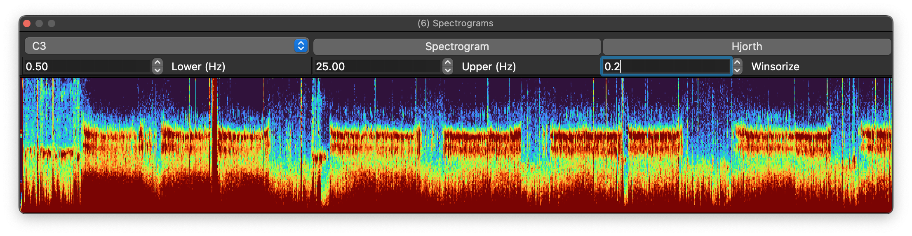
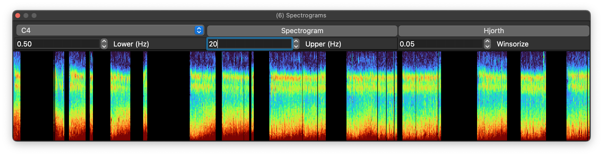
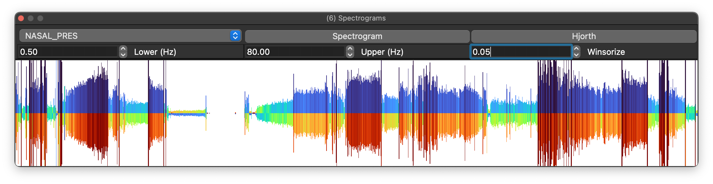

# Spectrograms

Spectrograms display the signal’s frequency–time decomposition.

Select the signal from the top-left drop-down (only signals with sampling rates of 32 Hz or more are listed here).  Then press _Spectrogram_ to generate a view,
where the x-axis is each epoch across the recording, the y-axis is frequency (Hz) and the z-axis (color heatmap) is spectral power. 

You can right-click on the plot to either copy the image to the clip-board, or save it as a file.

## Spectrogram parameters

Frequency ranges are customizable: here we increase the maximum
frequency to 80 Hz (and repress _Spectrogram_) to generate this image:

Sometimes the dynamic range of the z-axis is restricted, due to outliers (e.g. very high amplitude signal artifact at the end of the recording). In
this case, it can help to _winsorize_ the range of z-values plotted (i.e. clipping to the _n-th_ percentile).  In this example we winsorize the
same spectrogram as at the top of this page, with a value of 20% (0.2):

## Masked/gapped recordings

If the EDF contains masked epochs, the plot should show that as follows, e.g. here with epochs restricted to N2 only:

## Hjorth plots

A generic alternative to a spectrogram is a Hjorth plot; here, the Y-axis shows magnitude (first Hjorth parameter), and the top/bottom colors
indicate the second/third Hjorth statistics of mobility and complexity respectively:

As a simple representation of signal amplitude, these plots can
be useful to show structure/artifact for signals where
(unlike the EEG) a typical spectrogram may be less useful.
